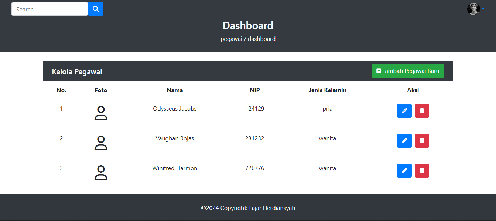

## About Laravel

Laravel is a web application framework with expressive, elegant syntax. We believe development must be an enjoyable and creative experience to be truly fulfilling. Laravel takes the pain out of development by easing common tasks used in many web projects, such as:

- [Simple, fast routing engine](https://laravel.com/docs/routing).
- [Powerful dependency injection container](https://laravel.com/docs/container).
- Multiple back-ends for [session](https://laravel.com/docs/session) and [cache](https://laravel.com/docs/cache) storage.
- Expressive, intuitive [database ORM](https://laravel.com/docs/eloquent).
- Database agnostic [schema migrations](https://laravel.com/docs/migrations).
- [Robust background job processing](https://laravel.com/docs/queues).
- [Real-time event broadcasting](https://laravel.com/docs/broadcasting).

## Preview

An employee CRUD system is a fundamental part of many applications. It allows you to manage employee data efficiently. CRUD operations refer to the basic actions you can perform on data: Create (add), Read (retrieve), Update (modify), and Delete (remove).

## How to install this project
<b>Step</b>
1. Clone Source Code from repo Github <a href="github.com/fahherd/crudsystem">fahherd/crudsystem</a>.
2. In CMD, cd to directory crudsytem.
3. Enter command <b>composer install</b>. need internet connection.
4. Run <b>php artisan</b> command, to test is artisan Laravel running.
5. Make your own empty database on mysql.
6. Copy file .env.example, raname .env.
7. Back to terminal and run <b>php artisan key:generate</b>.
8. Setting database connection in .env file (DB_DATABASE, DB_USERNAME, DB_PASSWORD). 
DB_CONNECTION=mysql 
DB_HOST=localhost 
DB_PORT=3306 
#DB_DATABASE=(Your db name) 
DB_DATABASE=example 
DB_USERNAME=root 
DB_PASSWORD=
9. Run <b>php artisan migrate</b> in CMD, To make a table. 
After all, run command <b>php artisan serve</b> then access localy from your browser with <b>http://localhost:8000/</b>
